# Using SDMX Constructor {#using-sdmx}

Welcome to the chapter on using SDMX Constructor! This chapter will cover three key topics that will help you make the most of this powerful tool.

The first topic we will cover is how to use SDMX Constructor to access SDMX artefacts from SDMX registries. This will include step-by-step instructions on how to use the tool to connect to a registry, browse its contents, and download the artefacts you need. Sections 4.1 and 4.2 will cover this topic. 

Next, we will dive into how to use SDMX Constructor to create new SDMX artefacts from scratch. Whether you need to create a new ConceptScheme, code list or DSD, SDMX Constructor provides a simple and intuitive interface to help you get the job done. Sections 4.3 to 4.7 will cover this topic.

Finally, we will explore how to use SDMX Constructor to work with .Stat Suite. This powerful platform is designed to help you analyse, visualise, and disseminate statistical data, and SDMX Constructor is the perfect complement to help you access and work with the SDMX artefacts you need. Sections 4.8 and 4.9 will cover this topic. 

By the end of this chapter, you will have a solid understanding of how to use SDMX Constructor to access, create, and work with SDMX artefacts, and you will be well on your way to becoming an expert in this powerful tool. So, let's get started!

## Accessing SDMX artefacts from registries {#accessing-sdmx}

In this section, we will walk you through the process of using SDMX Constructor on your computer to access and view the SDMX artefacts from the SDMX registries. This will enable you to easily browse and download the artefacts you need, for example, from the default registries already available in the SDMX Constructor.

**Default SDMX registries**

You can use the SDMX Constructor on your computer to access and view the SDMX artefacts from the SDMX registries. By default, SDMX Constructor offers the following registries to access SDMX artefacts: SDMX Global Registry: (<https://registry.sdmx.org/>), United Nations Statistics Division (UNSD): (<https://data.un.org/WS>), the Italian National Institute of Statistics (ESTAT) and the ILO Department of Statistics (ILOSTAT): (<https://www.ilo.org/sdmx/index.html>). You can view these by going to the Registry button and opening the Registry Name dropdown in the SDMX Registry tab, as shown below.

```{r 044, echo=FALSE, fig.align="center", out.width="100%"}

```
[Click here to enlarge the image](images/image044.png)

As shown below, select a registry from the dropdown option to load the artefacts.

```{r 046, echo=FALSE, fig.align="center", out.width="100%"}

```
[Click here to enlarge the image](images/image046.png)

**How to add a new registry to the list**

You can also use the SDMX Constructor to access and view the SDMX artefacts from additional SDMX registries. You can do that by following these steps. 

Click on the Registry button as shown below. It will open up a pop-up window and show the SDMX Registry tab. 

```{r 235, echo=FALSE, fig.align="center", out.width="100%"}

```
[Click here to enlarge the image](images/image235.png)

Clicking the New button will clear the two fields: Registry Name and Base URL. 

```{r 236, echo=FALSE, fig.align="center", out.width="100%"}

```
[Click here to enlarge the image](images/image236.png)

To illustrate further with an example, let's take the case of the Bank for International Settlements (BIS) SDMX registry here: https://stats.bis.org/api-doc/v1

In the fields ‘Registry Name’ and ‘Base URL’, fill in the required details. For the Registry Name, let's write BIS, and for the Base URL, enter https://stats.bis.org/api-doc/v1. Pressing the Save button will result in a confirmation message indicating that the Registry URL is successfully saved, as shown below.

```{r 237, echo=FALSE, fig.align="center", out.width="100%"}
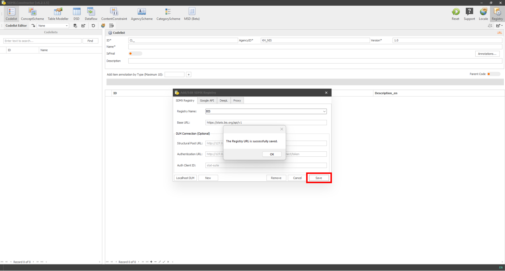
```
[Click here to enlarge the image](images/image237.png)

Click on OK to close the message. 

Now, we can see the SDMX artefacts from the BIS SDMX registry. For instance, you can now click Codelist and select BIS from the ‘Load from Registry’ option. This action will load the code lists from the BIS SDMX registry, as shown below. 

```{r 238, echo=FALSE, fig.align="center", out.width="100%"}

```
[Click here to enlarge the image](images/image238.png)

By accessing the default registries or adding new ones, you can easily access SDMX artefacts from registries, making data retrieval and analysis more efficient and effective.

## Setting up a registry as a local folder {#setting-up}

You can use the SDMX Constructor to create SDMX artefacts on your computer without a complicated setup. You can start using it with a local folder on your computer. Following are the steps to set up a registry in a computer's local folder.

-   On your computer, create a folder, and let's call it LOCAL_REGISTRY [^index-6]. The screenshot below shows that the folder is created within the C drive.

[^index-6]: You can name the folder as you prefer; however, there are some good practices which you can follow. For example, consider using a naming convention like "My_Registry" or "XXX_Reg". Use "LOCAL_XXX" as a consistent naming convention for all local registries if you expect multiple registries, with XXX as a placeholder for differentiation. Also, the folder's name can be different from the registry's name as long as it's clear which set of artefacts it contains. Keep in mind that you can create multiple local registries in different folders.

```{r 048, echo=FALSE, fig.align="center", out.width="100%"}
knitr::include_graphics("./images/image048.png")
```
[Click here to enlarge the image](images/image048.png)

-   Start the SDMX Constructor.
-   Click on the Registry button on the SDMX Constructor. It will open a pop-up window showing the default entries in the SDMX Registry tab.

```{r 050, echo=FALSE, fig.align="center", out.width="100%"}
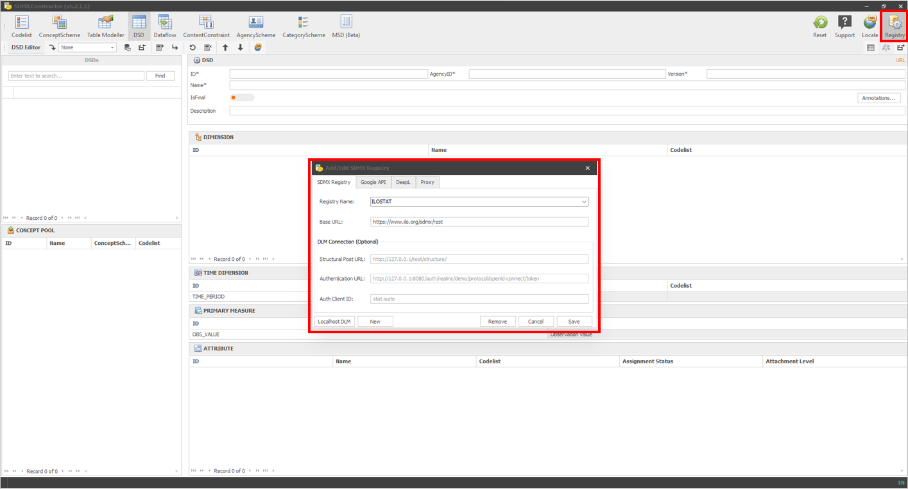
```
[Click here to enlarge the image](images/image050.png)

-   In the pop-up window, there are only two fields where we need to make changes: Registry Name and Base URL. You can click the 'New' button (which will clear the fields) or type directly within the fields.
-   For Registry Name, please type the name of the folder we created before LOCAL_REGISTRY.
-   For the Base URL, get the path of the folder (shown below).

```{r 052, echo=FALSE, fig.align="center", out.width="100%"}
knitr::include_graphics("./images/image052.png")
```
[Click here to enlarge the image](images/image052.png)

-   After entries in two fields, the pop-up window will look like this:

```{r 054, echo=FALSE, fig.align="center", out.width="100%"}
knitr::include_graphics("./images/image054.png")
```
[Click here to enlarge the image](images/image054.png)

-   Hit Save. It will generate a confirmation message, as shown below.

```{r 056, echo=FALSE, fig.align="center", out.width="100%"}
knitr::include_graphics("./images/image056.png")
```
[Click here to enlarge the image](images/image056.png)

-   Press OK to confirm. The pop-up windows will go away.
-   To confirm if the folder is accessible from the tool, in the Editor Ribbon area, if you go to the 'Load from registry' option, you will see the LOCAL_REGISTRY in the dropdown options.

```{r 058, echo=FALSE, fig.align="center", out.width="100%"}
knitr::include_graphics("./images/image058.png")
```
[Click here to enlarge the image](images/image058.png)

-   The setup with a local folder is complete.

## Preparing inputs {#preparing-inputs}

To demonstrate the key functionalities of the SDMX Constructor, it is helpful to have a dummy dataset modelled appropriately.

Imagine a country called Demoland and its National Statistical Office (NSO), Demoland NSO. Imagine the Demoland NSO is creating SDMX artefacts for its data in the following two tables.


| Region            | 2015 | 2015 | 2015 | 2016 | 2016 | 2016 |
|:-------------------|:---------:|:------------:|:-----------------:|:----------:|:------------:|:-----------------:|
|                    | **Men**     | **Women**      | **Both Sexes**      | **Men**      | **Women**      | **Both Sexes**      |
| Cities and Towns   | 14.4    | 20.7       | 17.6            | 14.4     | 21         | 17.2            |
| Urban Villages     | 27.8    | 30.3       | 29.1            | 28.2     | 29.4       | 29.1            |
| Rural Areas        | 26.2    | 29.6       | 28              | 26.2     | 29.5       | 27.1            |
| Total              | 24      | 27.9       | 26              | 24       | 27.9       | 26              |

: (#tab:table41) Unemployment Rate by sex and region


| Age Group | Men    | Women  | Both Sexes |
|:-----------|:--------:|:--------:|:------------:|
| 15-24     | 130,088| 133,770| 263,856    |
| 25-34     | 33,165 | 60,240 | 93,405     |
| 35-44     | 21,970 | 38,944 | 60,914     |
| 45-54     | 18,631 | 36,403 | 55,034     |
| 55-64     | 26,821 | 44,010 | 70,831     |
| 65+       | 45,323 | 78,725 | 124,048    |
| Total     | 275,997| 392,092| 668,088    |

: (#tab:table42) Population outside the labour force by sex and age group (2022)

After modelling the data in both tables, we have the following ConceptScheme and Codelist arranged below. Note that the order of the columns in the following tables is per the SDMX Constructor’s bulk load default templates (ConceptScheme and Codelist).

**ConceptScheme:**

| Concept ID   | Concept Name       | Description                                                             | Codelist ID   |
|:--------------|:--------------------|:------------------------------------------------------------------------|:---------------|
| INDICATOR    | Indicator          | Refers to statistical measure describing a particular aspect of a social, economic or environmental phenomenon | CL_INDICATOR  |
| UNIT_MEASURE | Unit of measure    | Unit in which the observation values are expressed                      | CL_UNIT_MEASURE |
| SEX          | Sex                | State of being male or female                                           | CL_SEX         |
| GEO          | Geographic area    | Refers to Urban or Rural locations                                      | CL_GEO         |
| TIME_PERIOD  | Time period        | Timespan or point in time to which the observation refers                | CL_TIME_PERIOD |
| FREQ         | Frequency          | Time interval at which observations occur over a given time period      | CL_FREQ        |
| AGE          | Age groups         | Length of time that an entity has lived or existed                       | CL_AGE         |
| OBS_VALUE    | Observation values | Refers to data or observation values                                    | CL_OBS_VALUE  |

: (#tab:table43) ConceptScheme

**Codelist:**

| Codelist ID   | Concept Name       | Code ID | Code Name                                       |
|:---------------|:--------------------|:---------|:------------------------------------------------|
| CL_INDICATOR  | Indicator          | UNER    | Unemployment Rate                              |
| CL_INDICATOR  | Indicator          | POLF    | Population outside the labour force            |
| CL_UNIT_MEASURE | Unit of measure   | RT      | Rate                                           |
| CL_UNIT_MEASURE | Unit of measure   | PS      | Persons                                        |
| CL_SEX        | Sex                | M       | Men                                            |
| CL_SEX        | Sex                | F       | Women                                          |
| CL_SEX        | Sex                | _T      | Both Sexes (Total)                             |
| CL_GEO        | Geographical area | M       | Cities and Towns (Metropolitan Area)            |
| CL_GEO        | Geographical area | U       | Urban Villages                                 |
| CL_GEO        | Geographical area | R       | Rural Areas                                    |
| CL_GEO        | Geographical area | _T      | Total                                          |
| CL_FREQ       | Frequency         | A       | Annual                                         |
| CL_AGE        | Age groups        | 15T24   | 15-24                                          |
| CL_AGE        | Age groups        | 25T34   | 25-34                                          |
| CL_AGE        | Age groups        | 35T44   | 35-44                                          |
| CL_AGE        | Age groups        | 45T54   | 45-54                                          |
| CL_AGE        | Age groups        | 55T64   | 55-64                                          |
| CL_AGE        | Age groups        | GE65    | 65+                                            |
| CL_AGE        | Age groups        | _T      | Total                                          |

: (#tab:table44) Codelist

We will use these dummy datasets in this user manual to illustrate some critical functionalities of SDMX Constructor. 

## Creating AgencyScheme {#creating-agencyscheme}

In the context of SDMX, an AgencyScheme is a type of structural metadata that provides information about the organisations or agencies responsible for producing or disseminating data. It defines the different roles these organisations play and assigns unique identifiers to them, allowing them to be easily referenced and identified within the SDMX framework.

The AgencyScheme is an important component of the SDMX infrastructure, as it enables data users to understand better the context of the data they are working with. It allows them to identify who produced the data, what their role was in the data production process, and where to go for more information.

For example, an AgencyScheme may include information on national statistical organisations, international organisations, or other data-producing entities. Each organisation or agency would be assigned a unique identifier and given a defined role within the AgencyScheme. Using the AgencyScheme allows data users to easily navigate the complex world of data production and dissemination, ensuring that they are working with accurate and reliable information.

To create an AgencyScheme, you can use the SDMX Constructor by following these steps:

-	Start the SDMX Constructor, click the AgencyScheme button on top, and select the folder we created before, LOCAL_REGISTRY, from the AgencyScheme Editor’s ‘Load from registry’ dropdown option, as shown below.

```{r 060, echo=FALSE, fig.align="center", out.width="100%"}
knitr::include_graphics("./images/image060.png")
```
[Click here to enlarge the image](images/image060.png)

-	Create an AgencyScheme by entering the ID, AgencyID, Version and Name in the fields as shown below. For this exercise, we will have only Demoland NSO as an agency (all data are from Demoland NSO). We will do it in two stages. First, we will enter the properties for the AgencyScheme and then create the agency. 


> **Note on IDs and versions**: In the context of SDMX, it is important to note that the identifiers for all SDMX artefacts follow a specific structure. These identifiers consist of a triplet composed of the "Agency ID," the "ID," and the "Version." It is worth emphasising that this naming convention applies not only to the AgencyScheme but also to other SDMX artefacts. However, unlike other SDMX artefacts that may undergo revisions and updates, the AgencyScheme is a foundational component within the SDMX framework. It defines the agencies or organisations involved in statistical data and metadata exchange, along with their unique identifiers (Agency ID). While the AgencyScheme identifier still follows the triplet structure of "Agency ID, ID, and Version," the version component remains fixed at 1.0. Also, note that a global guideline, ‘Guideline for CL_ORGANIZATION’, describes a method to build and maintain code lists for "organisations" broadly. https://sdmx.org/wp-content/uploads/CL_ORGANISATION-1.0_April_2021.docx.


-	For ID, enter AGENCIES; For AgencyID, enter Demoland_NSO; for version, enter 1.0; and for the Name, enter Demoland NSO Agency Scheme as shown below.

```{r 062, echo=FALSE, fig.align="center", out.width="100%"}
knitr::include_graphics("./images/image062.png")
```
[Click here to enlarge the image](images/image062.png)

-	Now, we create the agency (as part of the AgencyScheme) by clicking on ‘Add New Agency’ as shown below.

```{r 064, echo=FALSE, fig.align="center", out.width="100%"}
knitr::include_graphics("./images/image064.png")
```
[Click here to enlarge the image](images/image064.png)

-	Clicking on ‘Add New Agency’ will open a pop-up window. We create the Demoland NSO agency by entering DEMOLAND_NSO in the ID and Demoland NSO in the Name field in the Add Agency pop-up and clicking Apply (as shown below).

```{r 066, echo=FALSE, fig.align="center", out.width="100%"}
knitr::include_graphics("./images/image066.png")
```
[Click here to enlarge the image](images/image066.png)

-	Once we finished creating the agency, it would look like the following (the agency will be in the AGENCY POOL).

```{r 068, echo=FALSE, fig.align="center", out.width="100%"}
knitr::include_graphics("./images/image068.png")
```
[Click here to enlarge the image](images/image068.png)

-	Move the agency from the AGENCY POOL to the AGENCY space on the right pane by selecting and dragging it. After the move, it would look like the following.

```{r 070, echo=FALSE, fig.align="center", out.width="100%"}
knitr::include_graphics("./images/image070.png")
```
[Click here to enlarge the image](images/image070.png)

-	Click the Export button highlighted below to save the agency scheme in the folder.

```{r 072, echo=FALSE, fig.align="center", out.width="100%"}
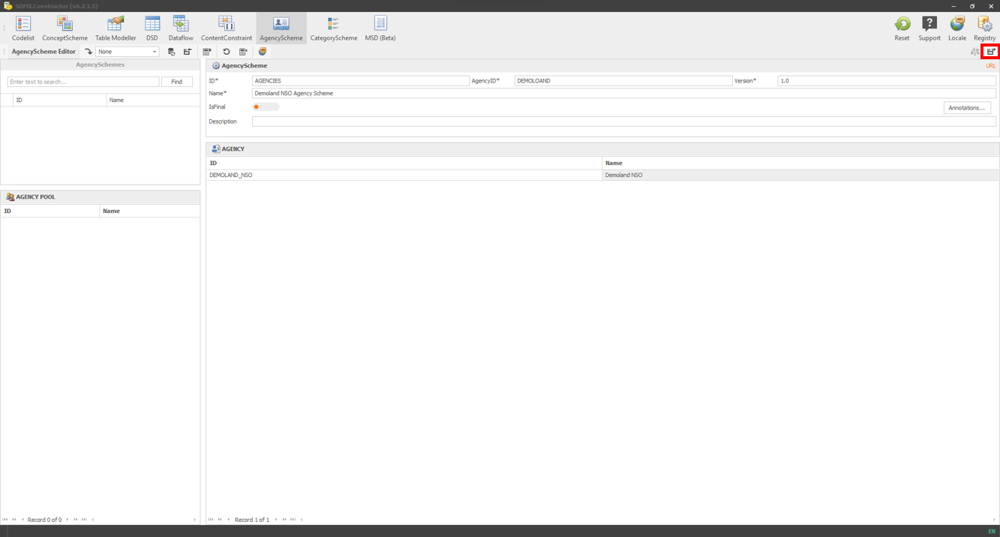
```
[Click here to enlarge the image](images/image072.png)

-	As shown below, a pop-up window will open to confirm the saving location.

```{r 074, echo=FALSE, fig.align="center", out.width="100%"}
knitr::include_graphics("./images/image074.png")
```
[Click here to enlarge the image](images/image074.png)

-	Clicking on Save will prompt another message (“All files in this directory (path) with delete and merged into a single file (path) are you sure to continue?”), as shown below.

```{r 076, echo=FALSE, fig.align="center", out.width="100%"}
knitr::include_graphics("./images/image076.png")
```
[Click here to enlarge the image](images/image076.png)

-	Clicking on Yes will create and save an XML file in the folder we created before, as shown below.

```{r 078, echo=FALSE, fig.align="center", out.width="100%"}
knitr::include_graphics("./images/image078.png")
```
[Click here to enlarge the image](images/image078.png)

-	Opening the file (LocalRegistry.xml) will show the agency scheme, as shown in the image below. 

```{r 080, echo=FALSE, fig.align="center", out.width="100%"}
knitr::include_graphics("./images/image080.png")
```
[Click here to enlarge the image](images/image080.png)


## Creating ConceptScheme & Codelist {#creating-conceptscheme}

In the context of SDMX, a ConceptScheme refers to a structured representation of concepts used to classify and describe statistical data and metadata. It serves as a framework or taxonomy for organising and categorising these concepts within the SDMX framework. 

A ConceptScheme provides a standardised and harmonised way of defining relevant concepts to a particular domain or statistical subject area. It helps ensure consistency in interpreting and using these concepts across different datasets and statistical systems.

When Concepts represent a statistical categorical variable (or qualitative variable), they can take on one of a limited and fixed number of possible values. In such a case, the concept is “enumerated”, and its representation is given by a Codelist that contains the valid values that the concept can take on and its meaning. For example, in a dataset on population demographics, the code list for the concept of sex might include codes such as Men, Women, and Both Sexes (Total).

**Create Codelist: The “one by one” approach.**

We can create a Concept Scheme in SDMX Consctuctor by following the steps described below. This section describes the one-by-one entry approach that is also possible, though the subsequent section illustrates the bulk load feature in detail.

- Click on the ConceptScheme button in the Editor menu. Then click the ‘Add New Concept’ button in the Editor Ribbon menu, as shown below.

```{r 239, echo=FALSE, fig.align="center", out.width="100%"}
knitr::include_graphics("./images/image239.png")
```
[Click here to enlarge the image](images/image239.png)

- The resulting pop-up window would look like the following.

```{r 240, echo=FALSE, fig.align="center", out.width="100%"}

```
[Click here to enlarge the image](images/image240.png)

- Provide the details as per the template. As an example, we choose the concept of ‘indicator’. Hence we could use ID = INDICATOR and Name = Indicator. For Description, we could use ‘Refers to statistical measure describing a particular aspect of a social, economic or environmental phenomenon’. We could keep the checkmark to add the code list (this would allow us to add the code list in the same interface), as shown below.  

```{r 241, echo=FALSE, fig.align="center", out.width="100%"}
knitr::include_graphics("./images/image241.png")
```
[Click here to enlarge the image](images/image241.png)

- Now, we have three options to add the code list. Option 1 is to 'Import Codelist from Registry', Option 2 is to ‘Upload Codelist from Local files', and below these options, as you can see in the image below, is the option to create a code list from scratch.

- We create the code list from scratch in the next step. We could use ID = CL_INDICATOR, Agency ID = DEMOLAND_NSO, Version = 1.0 and Name = Indicator

- We add two items to the code list for illustration purposes. ID = UNER, Name: Unemployment Rate and ID = POLF, Name = Population outside the labour force in two rows. Use the Append or + button to add multiple rows, as highlighted below.

```{r 242, echo=FALSE, fig.align="center", out.width="100%"}

```
[Click here to enlarge the image](images/image242.png)

- Click the Apply button (as highlighted below).

```{r 243, echo=FALSE, fig.align="center", out.width="100%"}
knitr::include_graphics("./images/image243.png")
```
[Click here to enlarge the image](images/image243.png)

- After clicking the Apply button, we will see the concept added in the CONCEPT POOL pane, as shown below.

```{r 244, echo=FALSE, fig.align="center", out.width="100%"}
knitr::include_graphics("./images/image244.png")
```
[Click here to enlarge the image](images/image244.png)

- Double-clicking on the concept scheme will open up the pop-up window, as shown below. This time, clicking ‘Save as SDMX - ML’ (other options are also available), as shown below, will start the standard process of saving the artefact in a local folder for later use.

```{r 245, echo=FALSE, fig.align="center", out.width="100%"}

```
[Click here to enlarge the image](images/image245.png)

- After creating all the concepts and related code lists, you can see all the concepts in the CONCEPT POOL, as shown below.

```{r 112, echo=FALSE, fig.align="center", out.width="100%"}
knitr::include_graphics("./images/image112.png")
```
[Click here to enlarge the image](images/image112.png)

- Move all the concepts from the CONCEPT POOL to the CONCEPT pane by selecting all (ctrl + a), then dragging and dropping. After the move, it would look like the following.

```{r 114, echo=FALSE, fig.align="center", out.width="100%"}
knitr::include_graphics("./images/image114.png")
```
[Click here to enlarge the image](images/image114.png)

- After moving the concepts, enter the details: (ID: CS_DEMOLAND_NSO, AgencyID: DEMOLAND_NSO, Version: 1.0, and Name: Concept Scheme of Demoland NSO) for the ConceptScheme, as shown below, to save the ConceptScheme. 

```{r 116, echo=FALSE, fig.align="center", out.width="100%"}
knitr::include_graphics("./images/image116.png")
```
[Click here to enlarge the image](images/image116.png)

- Then, click the ‘Save with descendants’ from the save option as shown below. This option, ‘Save with descendants,’ will save the concept scheme with the code list.

```{r 118, echo=FALSE, fig.align="center", out.width="100%"}
knitr::include_graphics("./images/image118.png")
```
[Click here to enlarge the image](images/image118.png)

- A pop-up message will ask to save the XML file in the folder (LOCAL_REGISTRY) we created before. Click on Save to save the file.

```{r 123, echo=FALSE, fig.align="center", out.width="100%"}
knitr::include_graphics("./images/image123.png")
```
[Click here to enlarge the image](images/image123.png)

- After clicking Save, the tool will ask the question to merge files. Select Yes.

```{r 125, echo=FALSE, fig.align="center", out.width="100%"}
knitr::include_graphics("./images/image125.png")
```
[Click here to enlarge the image](images/image125.png)

- A confirmation message will appear briefly at the bottom right corner, as shown below.

```{r 127, echo=FALSE, fig.align="center", out.width="100%"}
knitr::include_graphics("./images/image127.png")
```
[Click here to enlarge the image](images/image127.png)

- After that, if you go to the file’s location, you will see the XML file created, as shown below.

```{r 129, echo=FALSE, fig.align="center", out.width="100%"}
knitr::include_graphics("./images/image129.png")
```
[Click here to enlarge the image](images/image129.png)

**Create Codelist: Bulk load.**

To create multiple Codelists and ConceptSchemes at once, you can use the SDMX Constructor by following these steps. First, upload the Code List and then the ConceptScheme. By completing these steps in sequence, you can create both artefacts in one go.

-	Click on the Codelist button on top and ensure that the folder we created before, LOCAL_REGISTRY, is selected from the Codelist Editor’s ‘Load from registry’ dropdown option, as shown below.

```{r 082, echo=FALSE, fig.align="center", out.width="100%"}
knitr::include_graphics("./images/image082.png")
```
[Click here to enlarge the image](images/image082.png)

-	Click on the Bulk load button as shown below.
 
```{r 084, echo=FALSE, fig.align="center", out.width="100%"}
knitr::include_graphics("./images/image084.png")
```
[Click here to enlarge the image](images/image084.png)

-	It will open up a pop-up window, as shown below.
 
```{r 086, echo=FALSE, fig.align="center", out.width="100%"}
knitr::include_graphics("./images/image086.png")
```
[Click here to enlarge the image](images/image086.png)

-	Copy the Codelist table (Table: \@ref(tab:table44)) we prepared before and paste its contents here. Before pasting, remember to click on the ID column (shown in white in the image below). Then, select the entire row (by clicking on the little arrow (pointing at the right) at the beginning of the rows).
 
```{r 088, echo=FALSE, fig.align="center", out.width="100%"}
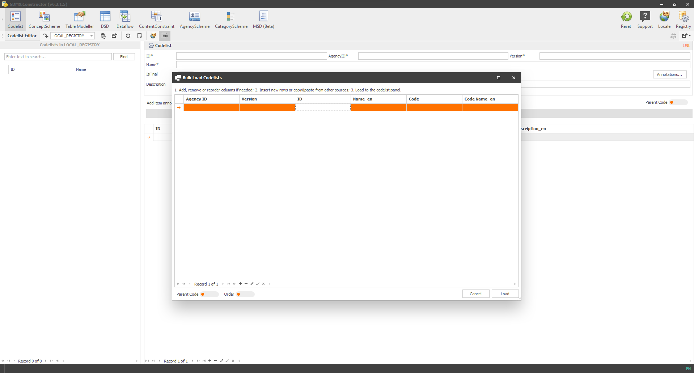
```
[Click here to enlarge the image](images/image088.png)

-	After pasting, remember to delete the header row. You can do this by selecting the entire row (by clicking again the little arrow pointing at the right at the beginning of the rows) and clicking the button (“-”) below, as indicated by a downward red arrow. 
 
```{r 090, echo=FALSE, fig.align="center", out.width="100%"}
knitr::include_graphics("./images/image090.png")
```
[Click here to enlarge the image](images/image090.png)

-	Enter the Agency ID and Version on the top row as DEMOLAND_NSO and 1.0, respectively, as shown below. If only the top row contains entries (DEMOLAND_NSO and 1.0) and the rest is empty, it implies that the Agency ID and Version are repeated for each row.
 
```{r 092, echo=FALSE, fig.align="center", out.width="100%"}
knitr::include_graphics("./images/image092.png")
```
[Click here to enlarge the image](images/image092.png)

-	Click on Load, as shown below.

```{r 094, echo=FALSE, fig.align="center", out.width="100%"}
knitr::include_graphics("./images/image094.png")
```
[Click here to enlarge the image](images/image094.png)

-	After the loading, this is how it would look (as shown below).

```{r 096, echo=FALSE, fig.align="center", out.width="100%"}
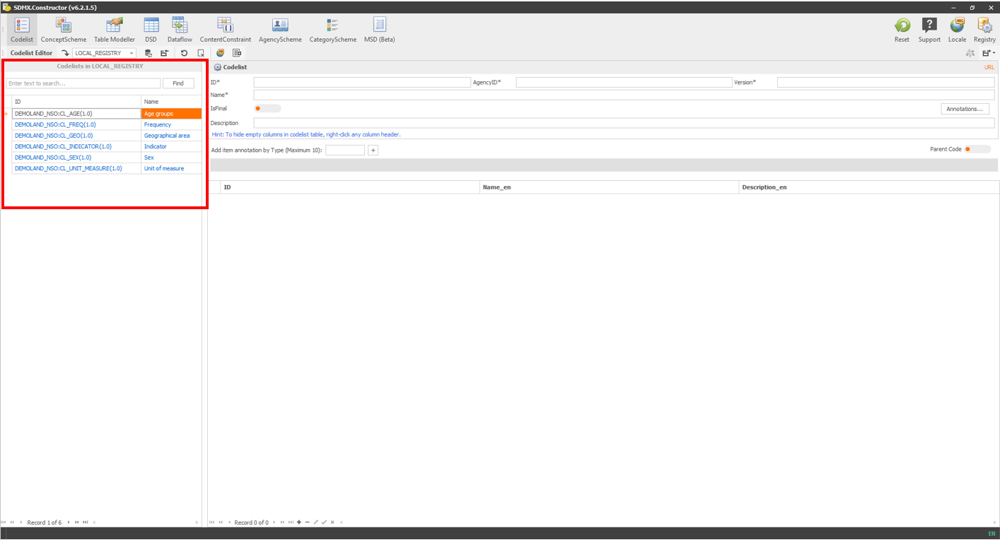
```
[Click here to enlarge the image](images/image096.png)

-	Clicking on any item on this list will show the details on the right pane, as shown below.
 
```{r 098, echo=FALSE, fig.align="center", out.width="100%"}
knitr::include_graphics("./images/image098.png")
```
[Click here to enlarge the image](images/image098.png)

**Create ConceptScheme:**

-	Click on the ConceptScheme button on top and ensure that the folder we created before, LOCAL_REGISTRY, is selected from the ConceptScheme Editor’s ‘Load from registry’ dropdown option, as shown below.
 
```{r 100, echo=FALSE, fig.align="center", out.width="100%"}

```
[Click here to enlarge the image](images/image100.png)

-	Click on the Bulk load button, as shown below.
 
```{r 102, echo=FALSE, fig.align="center", out.width="100%"}
knitr::include_graphics("./images/image102.png")
```
[Click here to enlarge the image](images/image102.png)

-	It will open up a pop-up window, as shown below.
 
```{r 104, echo=FALSE, fig.align="center", out.width="100%"}
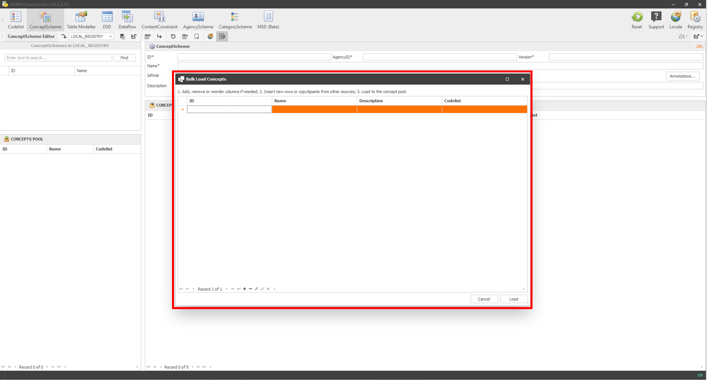
```
[Click here to enlarge the image](images/image104.png)

-	Copy the ConceptScheme table (Table: \@ref(tab:table43)) we prepared before and paste its contents here. Before pasting, remember to click on the ID column and select the entire row (by clicking on the little arrow at the beginning of the rows).
 
```{r 106, echo=FALSE, fig.align="center", out.width="100%"}
knitr::include_graphics("./images/image106.png")
```
[Click here to enlarge the image](images/image106.png)

-	After pasting, remember to delete the header row by selecting the entire row and using the button (“-”) below, as indicated by a downward red arrow. 
 
```{r 108, echo=FALSE, fig.align="center", out.width="100%"}

```
[Click here to enlarge the image](images/image108.png)

-	Click on Load, as shown below.

```{r 110, echo=FALSE, fig.align="center", out.width="100%"}

```
[Click here to enlarge the image](images/image110.png)

-	After loading, the concepts will be visible in the CONCEPT POOL, as shown below.
 
```{r 279, echo=FALSE, fig.align="center", out.width="100%"}
knitr::include_graphics("./images/image279.png")
```
[Click here to enlarge the image](images/image279.png)

-	Move all the concepts from the CONCEPT POOL to the CONCEPT pane by selecting all (ctrl + a), then dragging and dropping. After the move, it would look like the following.
 
```{r 280, echo=FALSE, fig.align="center", out.width="100%"}
knitr::include_graphics("./images/image280.png")
```
[Click here to enlarge the image](images/image280.png)

-	After moving the concepts, enter the details: (ID: CS_DEMOLAND_NSO, AgencyID: DEMOLAND_NSO, Version: 1.0, and Name: Concept Scheme of Demoland NSO) for the ConceptScheme, as shown below.

```{r 281, echo=FALSE, fig.align="center", out.width="100%"}
knitr::include_graphics("./images/image281.png")
```
[Click here to enlarge the image](images/image281.png)

-	Then, click the ‘Save with descendants’ from the save option as shown below. This option, ‘Save with descendants, ’ will save the concept scheme with the codelist. 
 
```{r 282, echo=FALSE, fig.align="center", out.width="100%"}
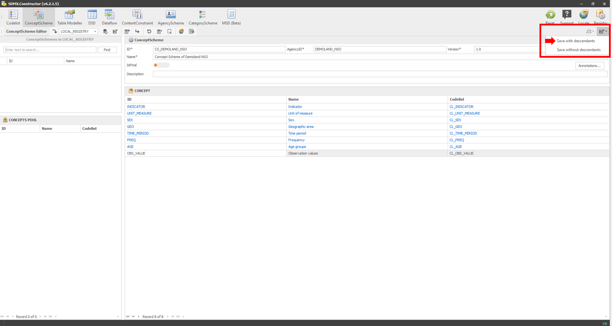
```
[Click here to enlarge the image](images/image282.png)

-	A pop-up message will ask to save the XML file in the folder (LOCAL_REGISTRY) we created before. Click on Save to save the file. 
 
```{r 283, echo=FALSE, fig.align="center", out.width="100%"}
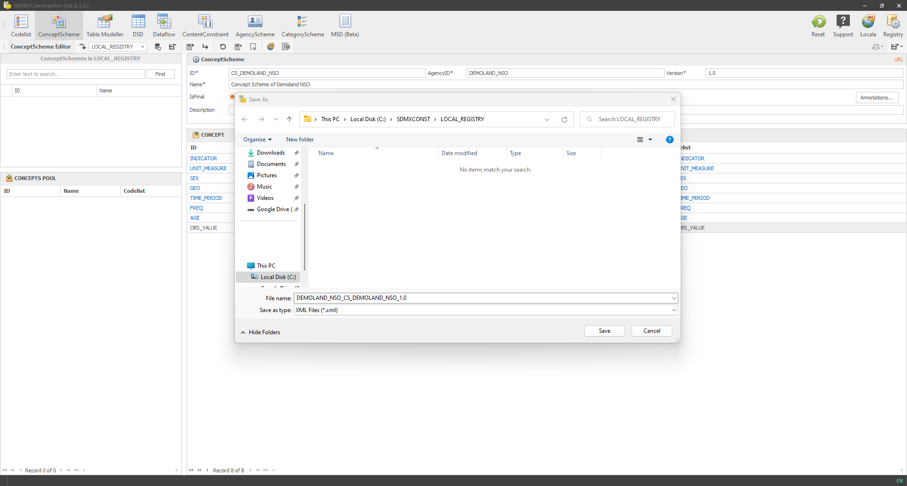
```
[Click here to enlarge the image](images/image283.png)

-	After clicking Save, the tool will ask the question to merge files. Select Yes. 
 
```{r 284, echo=FALSE, fig.align="center", out.width="100%"}
knitr::include_graphics("./images/image284.png")
```
[Click here to enlarge the image](images/image284.png)

-	A confirmation message will appear for a short time at the bottom right corner, as shown below.
 
```{r 285, echo=FALSE, fig.align="center", out.width="100%"}
knitr::include_graphics("./images/image285.png")
```
[Click here to enlarge the image](images/image285.png)

-	After that, if you go to the file’s location, you will see the XML file created, as shown below.
 
```{r 246, echo=FALSE, fig.align="center", out.width="100%"}

```
[Click here to enlarge the image](images/image246.png)

-	Opening the XML file will show the details containing, AgencyScheme, ConceptScheme and Codelists. 

## Creating DSD, ContentConstraint and Dataflow  {#creating-dsd}

In SDMX, a Data Structure Definition (DSD) is used to organise data in a specific format. Represented as a cube, a DSD is made up of dimensions and attributes. A Dataflow, on the other hand, represents a specific portion or filtered view of the cube that the DSD represents. A Content Constraint specifies the permitted code list and codes for a particular Dataflow. 

In SDMX Constructor, we can create DSDs, Dataflows and Concent Constraints either by “one by one” approach or in one go using the Table Modeller functionality.

We will first see how to apply the “one by one” approach and, subsequently, the Table Modeller functionality. 

**The “one by one” approach**

Creating DSD

The following steps assume you already have a ConceptScheme created and the corresponding SDMX-ML (XML) file is saved on your computer. 

- Start the SDMX Constructor. Click on the DSD button in the Editor menu and ensure that the folder we created before, LOCAL_REGISTRY, is selected from the ‘Load from registry’ dropdown option, as shown below.

```{r 247, echo=FALSE, fig.align="center", out.width="100%"}

```
[Click here to enlarge the image](images/image247.png)

- Click on the ‘Load Concepts’ in the Editor Ribbon menu, as shown below. 

```{r 248, echo=FALSE, fig.align="center", out.width="100%"}

```
[Click here to enlarge the image](images/image248.png)

- In the resulting window, as shown below, select the SDMX Registry (which will be LOCAL_REGISTRY in this case). Then click on Load, as shown below. 

```{r 249, echo=FALSE, fig.align="center", out.width="100%"}

```
[Click here to enlarge the image](images/image249.png)

The concepts will be visible in the CONCEPT POOL, as shown below.

```{r 250, echo=FALSE, fig.align="center", out.width="100%"}

```
[Click here to enlarge the image](images/image250.png)

- Drag and drop the concepts from the CONCEPT POOL to either the DIMENSION or the ATTRIBUTE pane on the right. For our example data, except for the Unit of Measurement, which will go to the ATTRIBUTE pane, all other concepts will be in the DIMENSION pane, as shown below.

```{r 251, echo=FALSE, fig.align="center", out.width="100%"}

```
[Click here to enlarge the image](images/image251.png)

- Note that by default, SDMX Constructor has preselected TIME DIMENSION and PRIMARY MEASURE on the right pane. However, ensure that the ConceptScheme fields in both are set to the same (DEMOLAND_NSO:CS_DEMOLAND_NSO(1.0)) as other dimensions. Double-clicking the TIME DIMENSION will open up the pop-up window where it can be specified, as shown below. Click Apply. 

```{r 252, echo=FALSE, fig.align="center", out.width="100%"}

```
[Click here to enlarge the image](images/image252.png)

- Repeat the same for the PRIMARY MEASURE as shown below. Click Apply. 

```{r 253, echo=FALSE, fig.align="center", out.width="100%"}

```
[Click here to enlarge the image](images/image253.png)

- Fill in the details for the DSD (ID = DSD_DEMOLAND_NSO, AgencyID = DEMOLAND_NSO, Version = 1.0 and Name = Concept Scheme for the Demoland NSO) as shown below.

```{r 254, echo=FALSE, fig.align="center", out.width="100%"}

```
[Click here to enlarge the image](images/image254.png)

- Clicking on the Export/Save button, as shown below, will open up a pop-up window where you can make the following adjustments: Use Local ConceptScheme - turn it off; output Codelists - turn it off and Output ConceptSchemes - turn it off. 

```{r 255, echo=FALSE, fig.align="center", out.width="100%"}

```
[Click here to enlarge the image](images/image255.png)

- Clicking on Run will show the following message. Click on Yes. 

```{r 256, echo=FALSE, fig.align="center", out.width="100%"}

```
[Click here to enlarge the image](images/image256.png)

- You will see a message confirming the creation of the DSD, as shown below.

```{r 257, echo=FALSE, fig.align="center", out.width="100%"}

```
[Click here to enlarge the image](images/image257.png)

- After that, you will see the XML file created if you go to the file’s location.

Creating Dataflow

- Click on the Dataflow button in the Editor menu and ensure that the folder we created before, LOCAL_REGISTRY, is selected from the ‘Load from registry’ dropdown option, as shown below.

```{r 258, echo=FALSE, fig.align="center", out.width="100%"}

```
[Click here to enlarge the image](images/image258.png)

- For this example of Dataflow, we will select ‘Table 4.1: Unemployment Rate by sex and region’. We will first enter the details (ID = DF_UNER_SEX_GEO, AgencyID = DEMOLAND_NSO, Version = 1.0 and Name: Unemployment Rate (UNER) by sex and region) as shown below. 

```{r 259, echo=FALSE, fig.align="center", out.width="100%"}

```
[Click here to enlarge the image](images/image259.png)

- Then click on the Annotation button. After that, click on Standard Types in the pop-up window. Then select the LAYOUT_COLUMN and LAYOUT_ROW from the list. Finally, click on the Add button, as shown below. 

```{r 260, echo=FALSE, fig.align="center", out.width="100%"}

```
[Click here to enlarge the image](images/image260.png)

- You will see the following window.

```{r 261, echo=FALSE, fig.align="center", out.width="100%"}

```
[Click here to enlarge the image](images/image261.png)

- Select the LAYOUT_COLUMN. Then click in the Title column field. Then click on the Select Items button. Then following the layout scheme of Table 4.1, select the items for LAYOUT_COLUMN: as SEX and TIME_PERIOD. Finally, click on the Insert button. 

```{r 262, echo=FALSE, fig.align="center", out.width="100%"}

```
[Click here to enlarge the image](images/image262.png)

- Repeat the same for the LAYOUT_ROW. Click inside the corresponding field of the column ‘Title’, then click on the Select Items button. Then select GEO (as per Table 4.1) and click on the Insert button. 

```{r 263, echo=FALSE, fig.align="center", out.width="100%"}

```
[Click here to enlarge the image](images/image263.png)

- This is how it would look after both entries. 

```{r 264, echo=FALSE, fig.align="center", out.width="100%"}

```
[Click here to enlarge the image](images/image264.png)

- Clicking on the Save button will result in the following confirmation.

```{r 265, echo=FALSE, fig.align="center", out.width="100%"}

```
[Click here to enlarge the image](images/image265.png)

- Click OK. It will now show the 2 annotation notifications as highlighted below.

```{r 266, echo=FALSE, fig.align="center", out.width="100%"}

```
[Click here to enlarge the image](images/image266.png)

- Now, in the DSD Allocation pane, in the Associated DSD dropdown, select the DSD on which this Dataflow will be based. We selected the DSD we created before - DEMOLAND_NSO:DSD_DEMOLAND_NSO(1.0). 

```{r 267, echo=FALSE, fig.align="center", out.width="100%"}

```
[Click here to enlarge the image](images/image267.png)

- Now click on the Export/Save button, as shown below and click on Save. 

```{r 268, echo=FALSE, fig.align="center", out.width="100%"}

```
[Click here to enlarge the image](images/image268.png)

- It will show a message as shown below.

```{r 269, echo=FALSE, fig.align="center", out.width="100%"}

```
[Click here to enlarge the image](images/image269.png)

- Clicking on Yes will show a message indicating that the XML file (containing the Dataflow) has been created. 

```{r 270, echo=FALSE, fig.align="center", out.width="100%"}

```
[Click here to enlarge the image](images/image270.png)

- After that, you will see the XML file created if you go to the file’s location.

Creating ContentConstraint

- Click on the ContentConstraint button in the Editor menu and ensure that the folder we created before, LOCAL_REGISTRY, is selected from the ‘Load from registry’ dropdown option, as shown below.

```{r 271, echo=FALSE, fig.align="center", out.width="100%"}

```
[Click here to enlarge the image](images/image271.png)

- Fill in the details for the ContentConstraint (ID = CC_UNER_SEX_GEO, AgencyID = DEMOLAND_NSO, Version = 1.0 and Name = Unemployment Rate (UNER) by sex and region) as shown below. 

```{r 272, echo=FALSE, fig.align="center", out.width="100%"}

```
[Click here to enlarge the image](images/image272.png)

- Then in the ConstraintAttachment pane, in the Attachment Type, select the Dataflow option and from the dropdown list underneath, select the relevant dataflow as shown below. 

```{r 273, echo=FALSE, fig.align="center", out.width="100%"}

```
[Click here to enlarge the image](images/image273.png)

- Then click the append (or +) button to add the required rows. 

```{r 274, echo=FALSE, fig.align="center", out.width="100%"}

```
[Click here to enlarge the image](images/image274.png)

- We add two rows. In the first row, we select the concept ‘Indicator’ and the value as UNER (for Unemployment Rate). In the second row, we select the concept ‘UNIT_Measure’ (for Unit of Measurement) and the value as RT (for Rate), as shown below. 

```{r 275, echo=FALSE, fig.align="center", out.width="100%"}

```
[Click here to enlarge the image](images/image275.png)

- Now click on the Export/Save button, as shown below and click on Save in the resulting window. 

```{r 276, echo=FALSE, fig.align="center", out.width="100%"}

```
[Click here to enlarge the image](images/image276.png)

- It will show a message as shown below.

```{r 277, echo=FALSE, fig.align="center", out.width="100%"}

```
[Click here to enlarge the image](images/image277.png)

Clicking on Yes will show a message in the bottom right-hand corner indicating that the XML file is created. 

```{r 278, echo=FALSE, fig.align="center", out.width="100%"}

```
[Click here to enlarge the image](images/image278.png)

After that, you will see the XML file created if you go to the file’s location.


**The Table Modeller approach**

In SDMX Constructor, the Table Modeller feature (Under special topics, the functionality of the [Table Modeller](#table-modeller) is detailed) provides an intuitive user interface for designing statistical tables and generating the corresponding SDMX artefacts in one go.

Recalling our two initial tables (Table: \@ref(tab:table41) and Table: \@ref(tab:table42)), we will now generate DSDs, ContentConstraints and Dataflows. We can create all these artefacts through the Table Modeller option in the SDMX Constructor.

-	Click on the Table Modeller button on top and ensure that the folder we created before, LOCAL_REGISTRY, is selected from the Table Modeller Editor’s ‘Load from registry’ dropdown option, as shown below.
 

```{r 130, echo=FALSE, fig.align="center", out.width="100%"}
knitr::include_graphics("./images/image130.png")
```
[Click here to enlarge the image](images/image130.png)

-	You will notice the concept scheme we created before, as highlighted below. 
 
```{r 132, echo=FALSE, fig.align="center", out.width="100%"}
knitr::include_graphics("./images/image132.png")
```
[Click here to enlarge the image](images/image132.png)

-	Double-clicking the concept scheme will move it to the CONCEPT POOL, as shown below.
 
```{r 134, echo=FALSE, fig.align="center", out.width="100%"}
knitr::include_graphics("./images/image134.png")
```
[Click here to enlarge the image](images/image134.png)

-	Now, you can select the concepts in the CONCEPT POOL, then drag and drop them into various spaces (Constant Dimensions, Header, Side, Measures & Observation Attributes and Footnotes & Table Attributes) on the right pane. The logic driving where to drop each concept comes from our original tables (Table: \@ref(tab:table41) and Table: \@ref(tab:table42)).

-	For Table \@ref(tab:table41) (Unemployment Rate by sex and region), the following distribution will be representative.
 
```{r 136, echo=FALSE, fig.align="center", out.width="100%"}
knitr::include_graphics("./images/image136.png")
```
[Click here to enlarge the image](images/image136.png)

-	We can now apply two constraints: one for the indicator’s name and the other for the unit of measure. The indicator’s name will be the Unemployment Rate, which we can select by double-clicking the moved indicator concept as shown below. 
 
```{r 138, echo=FALSE, fig.align="center", out.width="100%"}
knitr::include_graphics("./images/image138.png")
```
[Click here to enlarge the image](images/image138.png)

-	Another constraint would be the unit of measure. Because it is ‘rate’ (for Table \@ref(tab:table41)), double-clicking the moved unit of measure concept would offer the option to select the rate. Select the Rate as shown below. 
 
```{r 140, echo=FALSE, fig.align="center", out.width="100%"}
knitr::include_graphics("./images/image140.png")
```
[Click here to enlarge the image](images/image140.png)

-	Now we add the table information as shown below.
 
```{r 142, echo=FALSE, fig.align="center", out.width="100%"}
knitr::include_graphics("./images/image142.png")
```
[Click here to enlarge the image](images/image142.png)

-	Then we will hit save (select ‘Save without descendants’), as shown below. 
 
```{r 144, echo=FALSE, fig.align="center", out.width="100%"}
knitr::include_graphics("./images/image144.png")
```
[Click here to enlarge the image](images/image144.png)

-	After saving, it will show a message as shown below.
 
```{r 146, echo=FALSE, fig.align="center", out.width="100%"}

```
[Click here to enlarge the image](images/image146.png)

-	Clicking on Continue will result in a pop-up asking to save the file, as shown below.
 
```{r 152, echo=FALSE, fig.align="center", out.width="100%"}
knitr::include_graphics("./images/image152.png")
```
[Click here to enlarge the image](images/image152.png)

-	Clicking Save will show this message and ask if the files should be merged.
 
```{r 154, echo=FALSE, fig.align="center", out.width="100%"}
knitr::include_graphics("./images/image154.png")
```
[Click here to enlarge the image](images/image154.png)

-	Clicking on Yes will merge the file. 
-	We will repeat the process for Table \@ref(tab:table42) (Population outside the labour force by sex and age group (2022)). We can do that by moving Age to the ‘Side’ space (and removing the Geo back to the CONCEPT POOL), changing the constraints for the indicator to ‘Population outside the labour force’ and unit of measure to ‘Persons’, and updating the table information as shown below. 
 
```{r 156, echo=FALSE, fig.align="center", out.width="100%"}
knitr::include_graphics("./images/image156.png")
```
[Click here to enlarge the image](images/image156.png)

-	After hitting the save (Save without descendants) button, the message will read like the one below.
 
```{r 158, echo=FALSE, fig.align="center", out.width="100%"}
knitr::include_graphics("./images/image158.png")
```
[Click here to enlarge the image](images/image158.png)

-	Proceed with ‘Continue’, ‘Save’, and ‘Yes’ for merge.

-	We should see two DSDs, two content constraints and two data flows. `Remember, dataflows are the filtered view of the DSDs.` 

## Creating CategoryScheme {#creating-category}

A CategoryScheme groups similar objects based on shared characteristics, providing a hierarchical structure that helps classify and organise data and metadata meaningfully.

It is crucial to distinguish between topics and specific indicators within those topics. For instance, in this user manual, we have used two indicators as examples: 'Unemployment Rate by sex and region' and 'Population outside the labour force by sex and age group.' Although these indicators focus on different aspects, they both fall under the broader topic of the Labour force. 

Referencing our two initial tables (Table: \@ref(tab:table41) and Table: \@ref(tab:table42)), we will create a CategoryScheme in the SDMX Constructor. The categorisation would be by the topic ‘Labour force’. 

-	First, we will click the CategoryScheme button and enter the properties (ID: CAS_BY_TOPIC, AgencyID: DEMOLAND_NSO, Version: 1.0 and Name: Categorisation Scheme By Topic) as shown below.
 
```{r 160, echo=FALSE, fig.align="center", out.width="100%"}
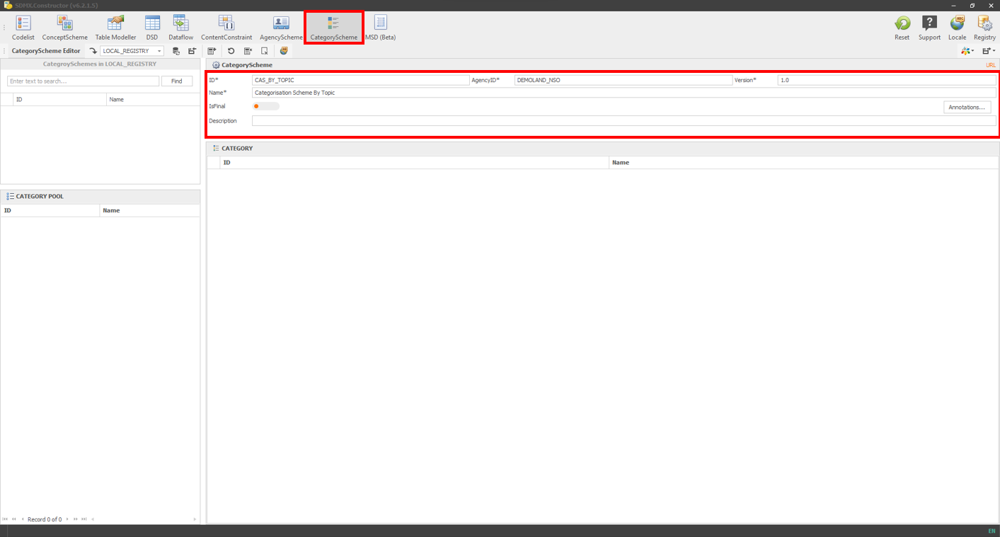
```
[Click here to enlarge the image](images/image160.png)

-	Click on “Add New Category”, as shown below.
 
```{r 162, echo=FALSE, fig.align="center", out.width="100%"}
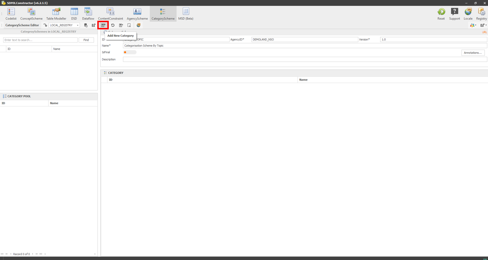
```
[Click here to enlarge the image](images/image162.png)

- It will open a pop-up window, as shown below. Enter the details: ID: LF (shorthand for Labour force), Name: Labour force and Description: The labour force is the sum of the number of persons employed and the number of persons unemployed.

```{r 164, echo=FALSE, fig.align="center", out.width="100%"}

```
[Click here to enlarge the image](images/image164.png)

- Click on the Load “Dataflows” button, as shown below. It will open another pop-up window to select the dataflows through the Registry.

```{r 166, echo=FALSE, fig.align="center", out.width="100%"}

```
[Click here to enlarge the image](images/image166.png)

- Select the Registry (LOCAL_REGISTRY), then the dataflows, and press Apply as shown below.

```{r 168, echo=FALSE, fig.align="center", out.width="100%"}
knitr::include_graphics("./images/image168.png")
```
[Click here to enlarge the image](images/image168.png)

- The resulting window will show the two dataflows in the dataflow pool, as shown below.

```{r 170, echo=FALSE, fig.align="center", out.width="100%"}

```
[Click here to enlarge the image](images/image170.png)

- Select both the dataflows and move (by dragging and dropping) to the Attached Dataflows pane on the right, as shown below. Click on Apply.

```{r 172, echo=FALSE, fig.align="center", out.width="100%"}
knitr::include_graphics("./images/image172.png")
```
[Click here to enlarge the image](images/image172.png)

- Clicking “Apply” in the previous step will take you to the following window, showing the entry into the CATEGORY POOL.

```{r 174, echo=FALSE, fig.align="center", out.width="100%"}

```
[Click here to enlarge the image](images/image174.png)

- Move it to the right pane, as shown below.

```{r 176, echo=FALSE, fig.align="center", out.width="100%"}
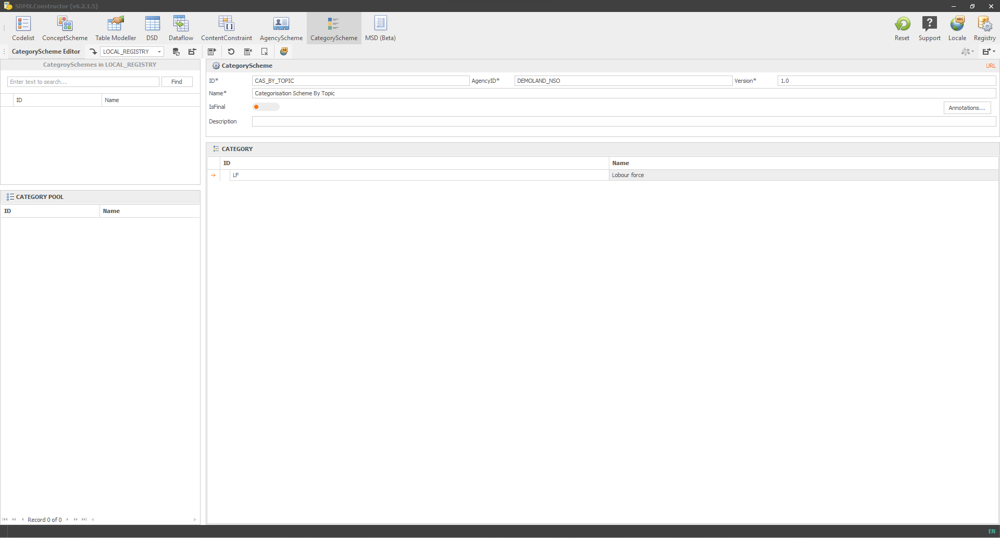
```
[Click here to enlarge the image](images/image176.png)

- Then hit Save (Save without descendants), and it will show the pop-up windows to ensure the location where it saves the file, as shown below.

```{r 178, echo=FALSE, fig.align="center", out.width="100%"}

```
[Click here to enlarge the image](images/image178.png)

- Clicking on Save will ask the confirmation to merge the file. Select Yes.

```{r 180, echo=FALSE, fig.align="center", out.width="100%"}

```
[Click here to enlarge the image](images/image180.png)

- The XML file (by going to the location of the folder we created before and opening the XML file) would be like the one below.

```{r 182, echo=FALSE, fig.align="center", out.width="100%"}
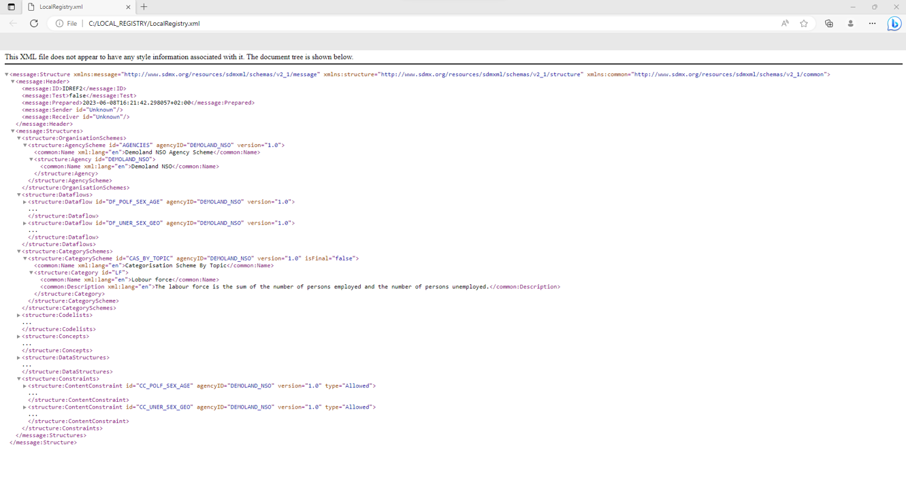
```
[Click here to enlarge the image](images/image182.png)


## Uploading XML file to the DLM {#uploading-xml}

You can upload the XML file containing the SDMX artefacts to the .Stat Data Lifecycle Manager (DLM). The DLM could be on the cloud or local computer (Localhost). Here is one case illustrated where we upload the XML file we created and saved using the SDMX Constructor in a folder to a locally hosted instance of the DLM. 


> **Note on artefact versioning**: Artefact versioning is crucial for managing SDMX artefacts, as it prevents conflicts when uploading structures to the DLM. This is especially important when multiple users work on the same artefact simultaneously or when updating artefacts over time. You may recall the usual place (in the right corner of the respective windows) to enter the version number in the user interface for creating or modifying artefacts in the SDMX Constructor.

-	Start the DLM. Configured as localhost, it will look like the following. 
 
```{r 188, echo=FALSE, fig.align="center", out.width="100%"}

```
[Click here to enlarge the image](images/image188.png)

-	Login using your credentials.
 
```{r 190, echo=FALSE, fig.align="center", out.width="100%"}
knitr::include_graphics("./images/image190.png")
```
[Click here to enlarge the image](images/image190.png)

-	Click on the ‘Upload structures’ button as shown below:
 
```{r 192, echo=FALSE, fig.align="center", out.width="100%"}
knitr::include_graphics("./images/image192.png")
```
[Click here to enlarge the image](images/image192.png)

-	Click on ‘Add files’ as shown below.
 
```{r 194, echo=FALSE, fig.align="center", out.width="100%"}
knitr::include_graphics("./images/image194.png")
```
[Click here to enlarge the image](images/image194.png)

-	Select the XML file we created before from the folder as shown below. (Note that the LocalRegistry.xml file can be uploaded at once and may contain multiple artefacts.) 
 
```{r 196, echo=FALSE, fig.align="center", out.width="100%"}
knitr::include_graphics("./images/image196.png")
```
[Click here to enlarge the image](images/image196.png)

-	After adding the file, select the ‘demo-design’ space, as shown below.
 
```{r 198, echo=FALSE, fig.align="center", out.width="100%"}

```
[Click here to enlarge the image](images/image198.png)

-	Click upload as shown below.
 
```{r 200, echo=FALSE, fig.align="center", out.width="100%"}
knitr::include_graphics("./images/image200.png")
```
[Click here to enlarge the image](images/image200.png)

-	As shown below, the green background and the message will indicate the successful XML file upload.
 
```{r 202, echo=FALSE, fig.align="center", out.width="100%"}
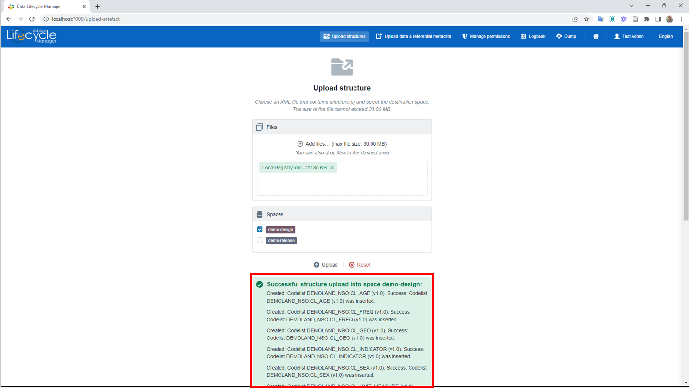
```
[Click here to enlarge the image](images/image202.png)

-	Clicking the Home icon will take you to the following interface.
 
```{r 204, echo=FALSE, fig.align="center", out.width="100%"}
knitr::include_graphics("./images/image204.png")
```
[Click here to enlarge the image](images/image204.png)

-	Here, selecting the options on the left navigation panel will show the artefacts on the main pane, as shown below.
 
```{r 206, echo=FALSE, fig.align="center", out.width="100%"}
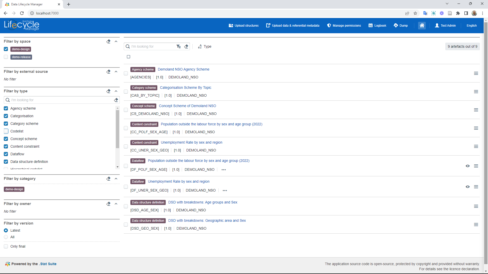
```
[Click here to enlarge the image](images/image206.png)


## Connecting to an SDMX registry {#connecting-to}

SDMX Constructor can also connect to a new SDMX registry (note: DLM is not a registry; .Stat Suite is. The DLM is composed of a set of back-office modules as one of the major components of the .Stat Suite that combines all data lifecycle management activities into one user interface.) directly, and users can directly pull or push (perhaps after editing) (with authentication credentials) artefacts from the SDMX Constructor. 

-	After launching the SDMX Constructor, click on the Registry, as shown below.
 
```{r 208, echo=FALSE, fig.align="center", out.width="100%"}

```
[Click here to enlarge the image](images/image208.png)

-	The default value you can see is as follows.
 
```{r 210, echo=FALSE, fig.align="center", out.width="100%"}

```
[Click here to enlarge the image](images/image210.png)

-	Change the default values for Registry Name and Base URL. For Registry Name, you can choose a name of your choice. For example, Registry Name could be DLM, and for the Base URL, the localhost configuration is already specified (by default, it will be http://127.0.0.1/rest/). 
 
```{r 212, echo=FALSE, fig.align="center", out.width="100%"}
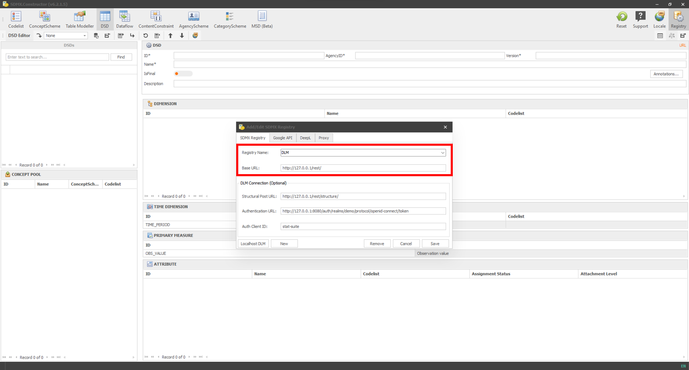
```
[Click here to enlarge the image](images/image212.png)

-	Clicking on Save will show the message shown below. Click on OK.
 
```{r 214, echo=FALSE, fig.align="center", out.width="100%"}
knitr::include_graphics("./images/image214.png")
```
[Click here to enlarge the image](images/image214.png)

-	Once the Registry is set, select it from the ‘Load from registry’ option, as shown below. 
 
```{r 216, echo=FALSE, fig.align="center", out.width="100%"}
knitr::include_graphics("./images/image216.png")
```
[Click here to enlarge the image](images/image216.png)

Doing this syncs the artefacts. For instance, you can see the dataflows in SDMX Constructor populated from the DLM. However, pushing any new entry (in this case, let’s say, a new dataflow) to DLM would require the credentials for the DLM. 

-	From the concepts obtained from the DLM, as shown below, let’s create a new data flow. 
 
```{r 218, echo=FALSE, fig.align="center", out.width="100%"}

```
[Click here to enlarge the image](images/image218.png)

-	Move the concepts around and enter table details as shown below.
 
```{r 220, echo=FALSE, fig.align="center", out.width="100%"}
knitr::include_graphics("./images/image220.png")
```
[Click here to enlarge the image](images/image220.png)

-	Apply the content constraints as shown below.
 
```{r 222, echo=FALSE, fig.align="center", out.width="100%"}

```
[Click here to enlarge the image](images/image222.png)

-	Then click on the Push to DLM button, as shown below.
 
```{r 224, echo=FALSE, fig.align="center", out.width="100%"}

```
[Click here to enlarge the image](images/image224.png)

-	Select ‘Push without descendants’.
 
```{r 226, echo=FALSE, fig.align="center", out.width="100%"}

```
[Click here to enlarge the image](images/image226.png)

-	After entering the credentials for the DLM, push, and you will see a message like the one below.
 
```{r 228, echo=FALSE, fig.align="center", out.width="100%"}
knitr::include_graphics("./images/image228.png")
```
[Click here to enlarge the image](images/image228.png)

-	After you have pressed the Continue button, you will see the following. The message mentions what has changed and what has not. In this case, it notes no DSD change, but one data flow and a content constraint have been created. 
 
```{r 230, echo=FALSE, fig.align="center", out.width="100%"}

```
[Click here to enlarge the image](images/image230.png)

-	Click on OK and go to the DLM. In the DLM, clicking on the dataflow would show the additional dataflow added directly through the SDMX Constructor to the DLM, as shown below.  
 
```{r 232, echo=FALSE, fig.align="center", out.width="100%"}

```
[Click here to enlarge the image](images/image232.png)
