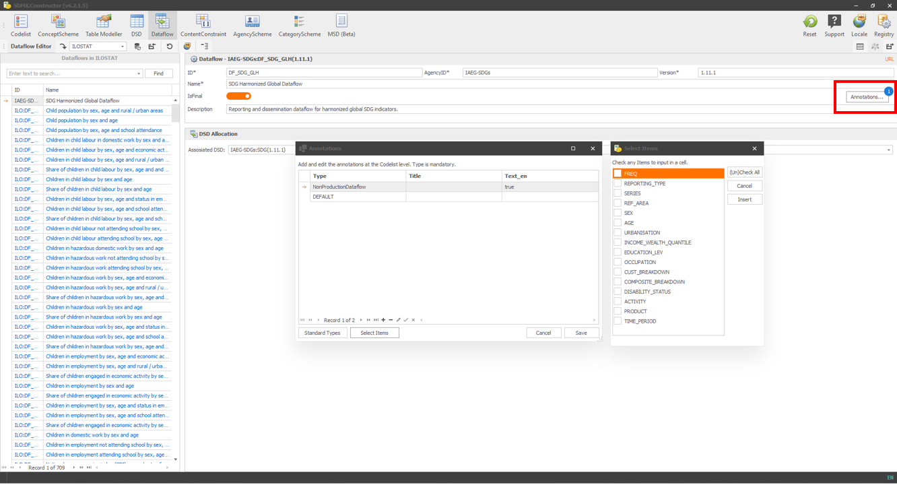

# Special Topics {#special-topics}

Welcome to the special topics chapter of the SDMX Constructor user manual. In this chapter, we will delve into three topics that require additional explanations. These topics are Annotations, Table Modeller and Translations using Google and Deepl APIs. By the end of this chapter, you will have a better understanding of how to utilise these features within the SDMX Constructor software tool. Let's get started!

## Annotations

The SDMX Constructor is a powerful tool that supports various types of SDMX artefact annotations, similar to what the .Stat Suite offers (see SDMX annotations supported by the .Stat Suite here: https://sis-cc.gitlab.io/dotstatsuite-documentation/using-de/sdmx-annotations/). 

Annotations in the SDMX framework are constructs that allow the user or organisation-specific metadata to be included. These annotations can be applied to a wide range of SDMX structural metadata artefacts, offering flexibility and customisation options.

The main advantage of annotation functionality within the SDMX Constructor is its adaptability. This flexibility is highly advantageous, especially for applications such as dissemination tools where custom metadata is crucial.

By leveraging the SDMX Constructor's support for annotations, users can enrich their data with additional information that goes beyond the standardised SDMX elements. These annotations can include context-specific details, explanations, or additional attributes relevant to the specific use case.

**A walkthrough**

For instance, an organisation may annotate a dataset with details about the dimensions to be presented in rows and columns of a presentation table or specify the default filters in the user interface of the dissemination interface. These annotations provide valuable context, enhance the understanding and interpretation of the data, and improve the dissemination tool's efficiency. 

Take an example within the ILOSTAT (https://data.ilo.org/), which is built using .Stat Suite. You can choose the following indicator - Labour force by sex, age and education - here. Note that in the resulting display, there are default filters applied (for example, for ‘Frequency’, it is Annual; for ‘Sex’, it is Total; and for ‘Age’, it is Youth and Adults (15+). Also, in the ‘Table’ view, you may notice that the country names (Reference area) and years (Time period) are in the rows and education levels are in the columns of the table. Such a specific display/interface is a result of the annotation settings. 

You can use the SDMX Constructor (as a back-end tool for the .Stat Suite) to specify such behaviour of loading and displaying data through its annotation functionality. In the SDMX Constructor, annotations are available through all Editor menu items such as Codelist, ConceptScheme, DSD, Dataflow, ConceptConstraint, AgencyScheme, CategoryScheme and MSD. We will see below how it works for the Dataflow as an example. It works similarly for other artefacts. As shown below, Annotations have three main components: Type, Title and Text (in multiple languages - if applicable). 

```{r 1, echo=FALSE, fig.align="center", out.width="100%"}

```
[Click here to enlarge the image](images/image1.png)

By clicking on ‘Standard Types’ on the pop-up, one can choose from the SDMX annotations supported by the .Stat Suite.

```{r 2, echo=FALSE, fig.align="center", out.width="100%"}
knitr::include_graphics("./images/image2.png")
```
[Click here to enlarge the image](images/image2.png)

Once checked/selected and added (for example, in the below image, Default, Layout_Column and Layout_Row are added), one can save the annotation by clicking the Save button. 

```{r 3, echo=FALSE, fig.align="center", out.width="100%"}
knitr::include_graphics("./images/image3.png")
```
[Click here to enlarge the image](images/image3.png)

Once saved, one can see the number of annotations displayed on the annotation button (as shown below).

```{r 4, echo=FALSE, fig.align="center", out.width="100%"}

```
[Click here to enlarge the image](images/image4.png)

If we load the ILOSTAT registry in the SDMX Constructor and select the Dataflow for the Labour force by sex, age and education, we see in-fact 7 annotations (as shown below). 

```{r 5, echo=FALSE, fig.align="center", out.width="100%"}

```
[Click here to enlarge the image](images/image5.png)

Clicking on the Annotations button will show the preselected Types, Titles and Text (in English) relevant to this Dataflow as shown below.

```{r 6, echo=FALSE, fig.align="center", out.width="100%"}
knitr::include_graphics("./images/image6.png")
```
[Click here to enlarge the image](images/image6.png)

**Titles**

To manually assign items in the ‘Title’ column of the annotation pop-up window, click on the desired row and click the 'Select Items' button. From there, you can choose from the available options, such as EDU for the row: LAYOUT_COLUMN for the 'Labour force by sex, age, and education' as shown below.

```{r 7, echo=FALSE, fig.align="center", out.width="100%"}
knitr::include_graphics("./images/image7.png")
```
[Click here to enlarge the image](images/image7.png)

Please be aware that the "Selected Items" button will become active under the circumstance: 1) When a registry is chosen, which permits the potential cross-referencing of artefacts (for example, selecting ILOSTAT), and 2) In the situations listed below:

1. Codelist Editor: The list of code items of the currently selected code list will be provided for selections. For example, in the image below, the first code list CL_ACTIVITY is double-clicked and then Annotations. After choosing items from ‘Standard Types’, one can choose Titles from the ‘Select Items’ button. 

```{r 8, echo=FALSE, fig.align="center", out.width="100%"}

```
[Click here to enlarge the image](images/image8.png)

2. ConceptScheme Editor: When you double-click a concept with a code list. The list of code items of the currently selected concept will be provided for selection. Clicking on the Annotations, as shown below, will offer the opportunity to select ‘Standard Types’ and Titles from the ‘Select Items’ button. 

```{r 9, echo=FALSE, fig.align="center", out.width="100%"}

```
[Click here to enlarge the image](images/image9.png)

3. DSD Editor: The list of Dimensions of the currently selected DSD will be available for selection. Clicking on the Annotations, as shown below, will offer the opportunity to select ‘Standard Types’ and Titles from the ‘Select Items’ button. 

```{r 10, echo=FALSE, fig.align="center", out.width="100%"}
knitr::include_graphics("./images/image10.png")
```
[Click here to enlarge the image](images/image10.png)

4. Dataflow Editor: The list of dimensions of the selected dataflow (the implied DSD) will be available for selection. Clicking on the Annotations, as shown below, will offer the opportunity to select ‘Standard Types’ and Titles from the ‘Select Items’ button. 

```{r 11, echo=FALSE, fig.align="center", out.width="100%"}

```
[Click here to enlarge the image](images/image11.png)

Annotations supported by the SDMX Constructor serve as a powerful tool for driving the display of data. By leveraging annotations' flexibility and customisation options, users can enhance the user experience and improve data interpretation. The SDMX Constructor's annotation support is valuable for users seeking to make their data more meaningful, informative, and visually engaging.

## Table Modeller {#table-modeller}

The Table Modeller functionality supports designing statistical tables using an intuitive user interface that generates the SDMX artefacts that model it. The interface is designed to use statistical terms to name objects, hiding the SDMX artefact names wherever possible, making it user-friendly and accessible.

By understanding the user interface (as shown below), the users of the Table Modeller functionality in SDMX Constructor can easily create statistical tables that generate the SDMX artefacts. Note that the table is a view of a container, which defines how the data will be stored. 
 
```{r 234, echo=FALSE, fig.align="center", out.width="100%"}
knitr::include_graphics("./images/image234.png")
```
[Click here to enlarge the image](images/image234.png)

The placeholders provided in the Table Modeller interface help users understand and include different concepts in the table and create well-defined SDMX artefacts.

A table in SDMX parlance represents a Dataflow, has a title, and comprises concepts (SDMX CONCEPTS) that take different roles in the table. The Table Modeller interface has various placeholders for the concepts, which are:

-	**Constant Dimensions:** A placeholder for SDMX CONCEPT type DIMENSIONS that remain constant across the table, such as indicator or measure and frequency.

-	**Header:** A placeholder for SDMX CONCEPT type DIMENSIONS that appear at the top of the table, such as time-period.

-	**Side:** A placeholder for SDMX CONCEPT type DIMENSIONS that appear on the left-hand side of the table. It can contain dimensions such as Age or Region (urban/rural).

-	**Measure & Observation Attributes:** A placeholder for observation values (or primary measure) and SDMX CONCEPT type ATTRIBUTES attached at the observation level, such as DECIMALS.

-	**Footnotes & Table Attributes:** A placeholder for SDMX CONCEPT type ATTRIBUTES such as ‘free text’ notes and ‘source’ attached at the dataset level.

**Using the Table Modeller**

-	You can “drag-and-drop” concepts from the CONCEPT POOL on the left panel to the different areas/spaces/placeholders on the right panel.

-	The concepts dropped in the “Side”, “Header”, and “Measure & Observation Attributes” areas will become DIMENSIONS. Note that the relative position of the concept in the area is relevant.

-	Concepts dropped in “Constant Dimensions” will also be DIMENSIONS, but the user will have to select one (and only one) item from each DIMENSION’S Codelist, which will be assigned to it (as ContentConstraint).

-	Concepts dropped in the “Measure & Observation Attributes” area, and the “Footnotes & Table Attributes” area will become ATTRIBUTES, the former attached at the Observation level and the latter at the Dataset level.

-	The outputs of the Table Modeller are the artefacts needed to represent in SDMX the table design.


## Translations using Google API/DeepL

We're working hard on finishing this section. Stay tuned for updates.

